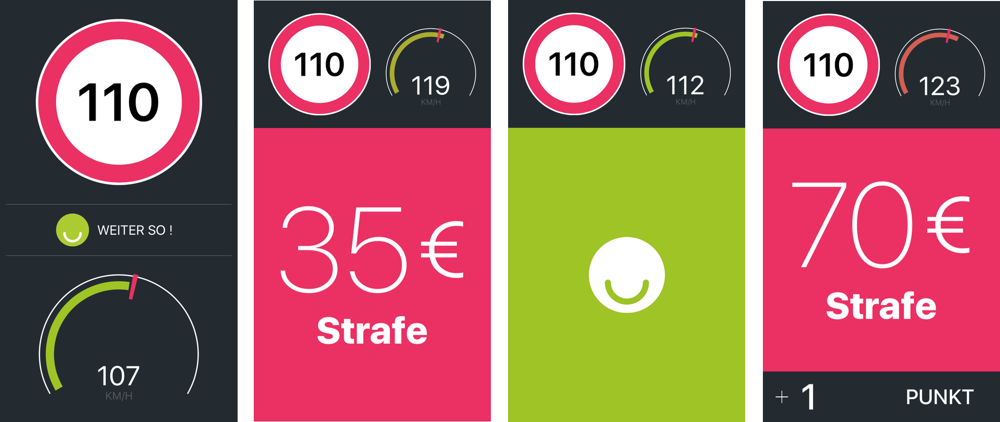

# LiveFines
> Real-time fine estimation while driving.

This native iOS app - while driving - shows the current speed limit, the current speed and the 
estimated fine if you are driving too fast and were caught right now.

It uses the HERE maps API and caches the speed limit waypoints in a local database to minimize
the number of API requests that need to be sent, especially for routes one drives on frequently.
Currently, it is only localized in German and designed to work on German roads.

### Screenshots


### Prerequisites

This project uses Swift 3 and is built for iOS 9.

Note that for the app to work, it needs a valid HERE maps app id and code, which you can aquire
for free [here](https://developer.here.com/). 
Once you have created your HERE maps project and acquired the keys, put them in a struct as follows:

```swift 
struct Secrets {
    static let appId = "<your-app-id>"
    static let appCode = "<your-app-code>"
}
```

### Dependencies
* [Realm](https://github.com/realm/realm-cocoa) as the local database
* [Alamofire](https://github.com/Alamofire/Alamofire) for the HTTP requests
* [SwiftyJSON](https://github.com/SwiftyJSON/SwiftyJSON) for JSON parsing

## License

This project is licensed under the MIT License.